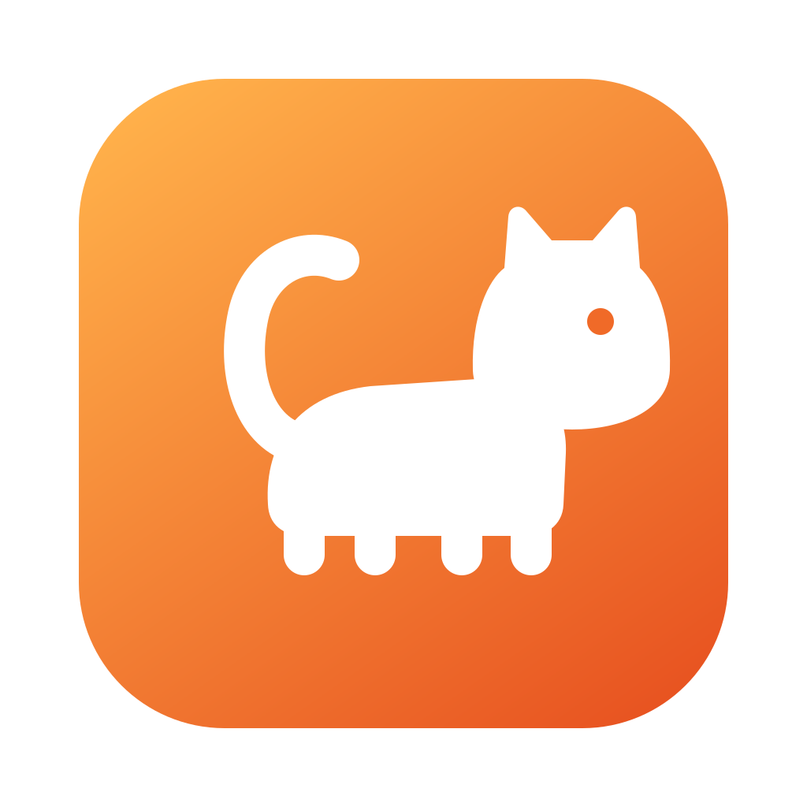

<p align="center">
  
</p>

# CopyKat

A fast, native clipboard manager for macOS. Press a hotkey, see everything you
copied (text **and images**), and paste it straight into the app you're
working in.

Built as a modern alternative to Flycut: same muscle memory, plus image
support and a Spotlight-style interface.

## Features

- **Text, images, and files.** Everything you copy is captured, including
  screenshots and copied images.
- **Spotlight-style panel.** Press ⇧⌘V (configurable), search, hit Enter.
  The panel never steals focus from the app you're in.
- **Direct paste.** Selecting an item pastes it immediately into the active
  app. This needs your permission once, and falls back to plain copying if
  you'd rather not grant it.
- **Pins.** Pin items to keep them at the top forever.
- **Privacy-aware.** Entries from password managers are ignored
  automatically, and you can exclude any app yourself.
- **Persistent.** History survives restarts, and you decide how much to keep.

## Install

Requires macOS 14 or later.

Grab the latest `CopyKat.zip` from the
[releases page](https://github.com/mixxamm/CopyKat/releases), unzip it, and
drag CopyKat to your Applications folder.

Or build it from source:

```bash
brew install xcodegen
git clone https://github.com/mixxamm/CopyKat.git
cd CopyKat
xcodegen generate
xcodebuild -scheme CopyKat -destination 'platform=macOS' build
```

The app lands in Xcode's DerivedData. For day-to-day development, open the
project in Xcode and hit ⌘R.

## How it works

CopyKat is a menubar app with a deliberately small core:

| Component | Role |
|---|---|
| `Monitor/` | Polls `NSPasteboard` (macOS offers no change notifications) and classifies new content |
| `Store/` | SwiftData-backed history; images live as PNG files on disk, deduplicated by content hash |
| `Panel/` | Non-activating `NSPanel` hosting the SwiftUI search panel, so focus stays in your app |
| `Paste/` | Writes the selection back to the clipboard and simulates ⌘V (Accessibility permission) |
| `Settings/` | Hotkey, history size, excluded apps, launch at login |

Sensitive clipboard entries marked with
[`org.nspasteboard.ConcealedType`](http://nspasteboard.org) are never stored.

## Contributing

See [CONTRIBUTING.md](CONTRIBUTING.md). Bug reports and PRs welcome.

## License

[MIT](LICENSE)
